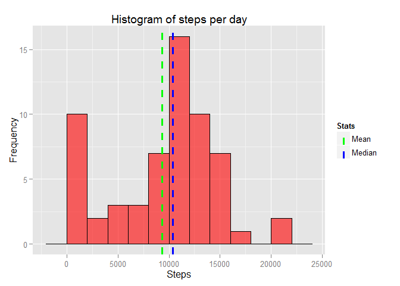
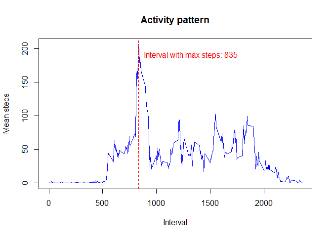
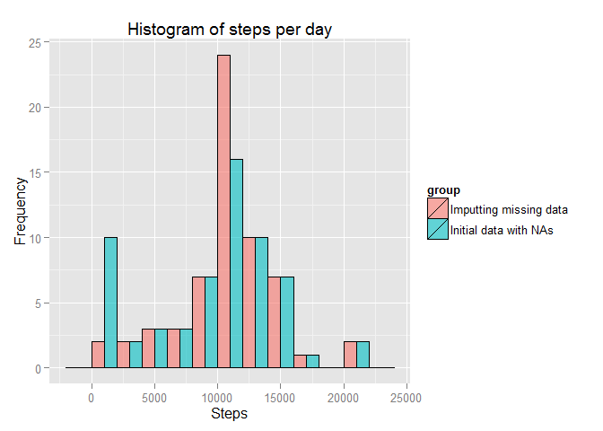
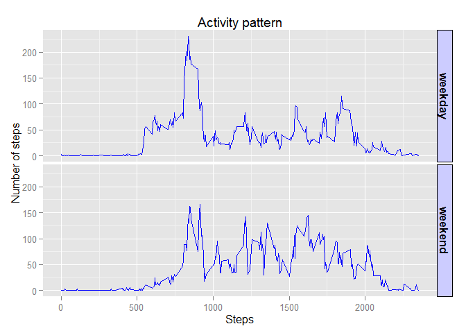

# Reproducible Research: Peer Assessment 1


## Loading and preprocessing the data

```r
#create connection to zip file
con<-unz("activity.zip","activity.csv")
# read csv from connection
data<-read.csv(con,na.strings = "NA",colClasses=c("numeric","Date","numeric"))
```

## What is mean total number of steps taken per day?

```r
library (dplyr,warn.conflicts=FALSE)
library(ggplot2)
#summarize steps by day
data_day<-data %>% group_by(date) %>% 
        summarise(steps.sum=sum(steps,na.rm = TRUE))
#estimate mean and median steps per day
steps_mean=mean(data_day$steps.sum)
steps_median=median(data_day$steps.sum)
```

####Mean total number of steps taken per day = **9354.23**  
####Median total number of steps taken per day = **10395.00**


```r
#show histogram of steps per day
ggplot(data =data_day,aes(steps.sum) )+
        geom_histogram( fill=I("red"),binwidth=2000,col="black",alpha=0.6)+
        labs(title="Histogram of steps per day",x="Steps",y="Frequency")+
        geom_vline(aes(xintercept=steps_mean,color="Mean"),
                   size=1.1,linetype=2,show_guide=TRUE)+
        geom_vline(aes(xintercept=steps_median,color="Median"),
                   size=1.1,linetype=2,show_guide=TRUE)+
        scale_colour_manual(name="Stats", values=c(Median="blue",Mean="green"))
```

 


## What is the average daily activity pattern?

```r
#summarize steps by interval
data_interval<-data %>% group_by(interval) %>% 
        summarise(steps.sum=mean(steps,na.rm = TRUE))
#find interval with maximum average s
max_interval<-data_interval$interval[which.max(data_interval$steps.sum)]
```
  
#### Interval **835**, on average across all the days in the dataset, contains the maximum number of steps  

```r
#draw plot
plot(data_interval$steps.sum~data_interval$interval,type="l",xlab="Interval",
     ylab="Mean steps",main="Activity pattern",col="blue")
abline(v=max_interval,col="red",lty = 2)
text(max_interval+490,190,paste("Interval with max steps:",
                                as.character(max_interval)),col="red")
```

 

## Imputing missing values

```r
na_number<-sum(is.na(data$step))
```
#### Total number of missing values is  **2304**

Let us make imputting of NAs with mean for that 5-minute interval  

```r
#imput NA with mean for that 5-minute interval
data_imput<-data %>% group_by(interval) %>%
        mutate(steps=ifelse(is.na(steps),mean(steps,na.rm=TRUE),steps))
# summarise by date
data_day_imput<-data_imput %>% group_by(date) %>% 
        summarise(steps.sum=sum(steps,na.rm = TRUE))
```


```r
#estimate mean and median steps per day
steps_mean_imput=mean(data_day_imput$steps.sum)
steps_median_imput=median(data_day_imput$steps.sum)
```
###Mean and median total number of steps taken per day

```r
library(xtable)
#create dataframe for mean and median
sum_mean<-data.frame(mean=c(steps_mean,steps_mean_imput),
                     median=c(steps_median,steps_mean_imput))
row.names(sum_mean)<-c("Initial data with NAs","Imputing missing data")
tab.attributes <- 'border="0" align="left" bgcolor="#FFCC00" 
        style="border-collapse: collapse; text-align: right; width: 50%; "'
print(xtable(sum_mean),type="html",html.table.attributes = tab.attributes)  
```

<!-- html table generated in R 3.2.2 by xtable 1.7-4 package -->
<!-- Wed Sep 23 10:07:36 2015 -->
<table border="0" bgcolor="#FFCC00" 
        style="border-collapse: collapse; text-align: right; width: 50%; ">
<tr> <th>  </th> <th> mean </th> <th> median </th>  </tr>
  <tr> <td align="right"> Initial data with NAs </td> <td align="right"> 9354.23 </td> <td align="right"> 10395.00 </td> </tr>
  <tr> <td align="right"> Imputing missing data </td> <td align="right"> 10766.19 </td> <td align="right"> 10766.19 </td> </tr>
   </table>
___________
  **Conclusion:** Imputting of the data affects mean and median values in 
  comparision with initial data from the first part of assigment. 
  Median and mean values increased after imputting of NAs.
  

```r
# merge initial dataset and dataset with imputting NA's
data_total<-rbind(data_day_imput %>% mutate(group=factor("Imputting missing data"))
                  ,data_day %>% mutate(group=factor("Initial data with NAs")))
```


```r
#show histogram of steps per day and per group
ggplot(data =data_total,aes(steps.sum,fill=group))+
        geom_histogram(binwidth=2000,col="black",alpha=0.6,position = "dodge")+
        labs(title="Histogram of steps per day",x="Steps",y="Frequency")
```

 

## Are there differences in activity patterns between weekdays and weekends?

```r
Sys.setlocale("LC_TIME", "C")
#create factor variable day indicating whether a given date is a weekday or weekend day
data_weekday<-ungroup(data_imput) %>% 
        mutate (day=factor(ifelse(weekdays(date)
        %in% c("Sunday","Saturday"),"weekend","weekday"))) %>%
        group_by(interval,day) %>%summarise(steps=mean(steps,na.rm = TRUE))
#draw a plot
ggplot(data_weekday,aes(interval,steps))+geom_line(col="blue")+
        facet_grid(day~.)+
        labs(title="Activity pattern",x="Steps",y="Number of steps")+
        theme(strip.text.x = element_text(size=8, angle=75),
          strip.text.y = element_text(size=12, face="bold"),
          strip.background = element_rect(colour="black", fill="#CCCCFF"))
```

 
